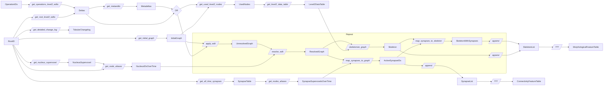

```mermaid

graph LR;
    get_root_level2_edits[/"`_get_root_level2_edits_`"/]
    get_operations_level2_edits[/"`_get_operations_level2_edits_`"/]
    get_detailed_change_log[/"`_get_detailed_change_log_`"/]
    get_metaedits[/"`_get_metaedits_`"/]
    apply_edit[/"`_apply_edit_`"/]
    get_initial_graph[/"`_get_initial_graph_`"/]
    resolve_edit[/"`_resolve_edit_`"/]
    get_nucleus_supervoxel[/"`_get_nucleus_supervoxel_`"/]
    skeletonize_graph[/"`_skeletonize_graph_`"/]
    get_all_time_synapses[/"`_get_all_time_synapses_`"/]
    map_synapses_to_graph[/"`_map_synapses_to_graph_`"/]
    get_nodes_aliases[/"`_get_nodes_aliases_`"/]
    map_synapses_to_skeleton[/"`_map_synapses_to_skeleton_`"/]
    get_used_level2_nodes[/"`_get_used_level2_nodes_`"/]
    get_node_aliases[/"`_get_node_aliases_`"/]
    get_level2_data_table[/"`_get_level2_data_table_`"/]
    append1[/"`_append_`"/]
    append2[/"`_append_`"/]
    append3[/"`_append_`"/]
    ???1[/"`_???_`"/]
    ???2[/"`_???_`"/]

    RootID-->get_root_level2_edits;
    get_root_level2_edits-->Deltas;

    OperationIDs-->get_operations_level2_edits;
    get_operations_level2_edits-->Deltas;

    RootID-->get_detailed_change_log;
    get_detailed_change_log-->TabularChangelog;

    Deltas-->get_metaedits;
    get_metaedits-->Metadeltas;

    RootID-->get_initial_graph;
    get_initial_graph-->InitialGraph

    Deltas-->AnyDelta{OR};
    Metadeltas-->AnyDelta{OR};
    AnyDelta-->apply_edit;

    RootID-->get_nucleus_supervoxel;
    get_nucleus_supervoxel-->NucleusSupervoxel;

    RootID-->get_node_aliases;
    NucleusSupervoxel-->get_node_aliases;
    get_node_aliases-->NucleusIDsOverTime;

    InitialGraph-->apply_edit

    NucleusIDsOverTime-->resolve_edit;

    RootID-->get_all_time_synapses;
    get_all_time_synapses-->SynapseTable;

    SynapseTable-->get_nodes_aliases;
    get_nodes_aliases-->SynapseSupervoxelsOverTime;

    SynapseSupervoxelsOverTime-->map_synapses_to_graph;

    InitialGraph-->get_used_level2_nodes; 
    AnyDelta-->get_used_level2_nodes;
    get_used_level2_nodes-->UsedNodes;
    UsedNodes-->get_level2_data_table;
    get_level2_data_table-->Level2DataTable;
    Level2DataTable-->skeletonize_graph;

    subgraph Repeat
        apply_edit-->UnresolvedGraph;
        UnresolvedGraph-->resolve_edit;
        resolve_edit-->ResolvedGraph;
        
        ResolvedGraph-->skeletonize_graph;
        skeletonize_graph-->Skeleton;
        Skeleton-->append1

        ResolvedGraph-->map_synapses_to_graph;
        map_synapses_to_graph-->ActiveSynapseIDs;

        
        
        ActiveSynapseIDs-->append2

        ActiveSynapseIDs-->map_synapses_to_skeleton

        Skeleton-->map_synapses_to_skeleton
        map_synapses_to_skeleton-->SkeletonWithSynapses

        SkeletonWithSynapses-->append3
    end

    append1-->SkeletonList
    append2-->SynapseList
    append3-->SkeletonList

    SkeletonList-->???1
    ???1-->MorphologicalFeatureTable;

    SynapseList-->???2
    ???2-->ConnectivityFeatureTable;

```
